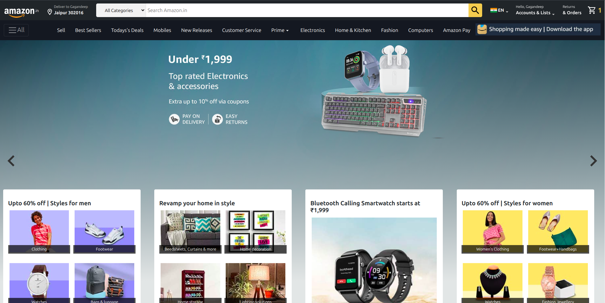
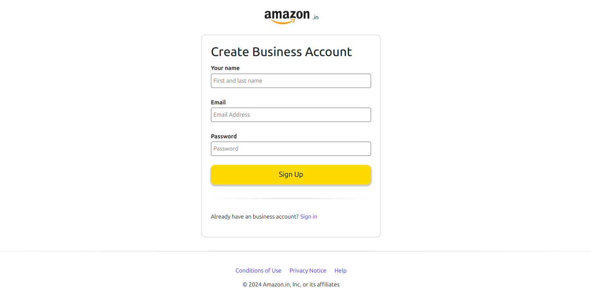
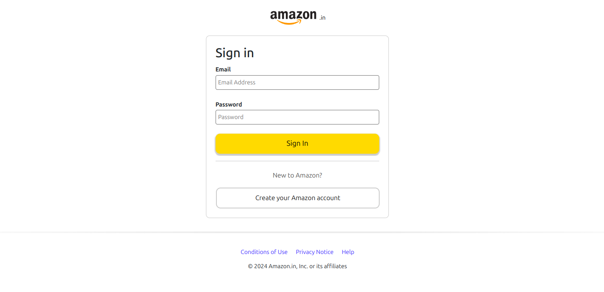
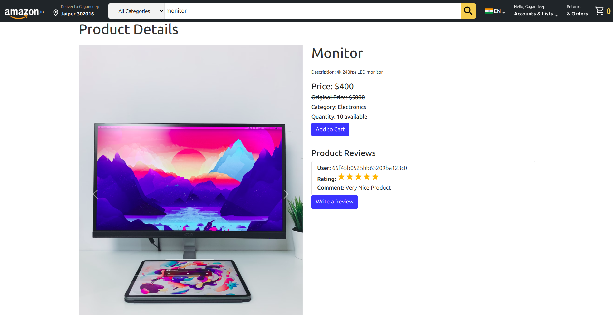

# Amazon Clone

This is a clone of the **Amazon** website, built with **React** on the frontend and **Node.js** on the backend. The clone mimics the structure, design, and essential functionality of the original Amazon website. Users can browse through products, sign up, sign in, and explore different categories.

## Features
- **Product Listing and Categories**: Browse through different product categories like electronics, fashion, and home decor.
- **User Authentication**: Create an account or sign in to your existing account.
- **Responsive UI**: Optimized for different screen sizes, providing a smooth user experience across devices.

## Tech Stack
- **Frontend**: React.js
- **Backend**: Node.js, Express.js
- **Authentication**: JWT (JSON Web Tokens)
- **Database**: MongoDB
- **Payment Gateway**: Stripe

## Screenshots

### Homepage

This is the homepage of the clone, displaying various categories and promotions similar to Amazon's homepage. Users can browse through categories, check offers, and navigate to product listings.

---

### Create Business Account

A user-friendly form allows new users to create a business account. The form ensures a simple and secure way to register for accessing business features.

---

### Sign In Page

Users can sign in to their accounts using this page. The page features a clean and simple layout with fields for email and password input.

---

### Product Page

The product page allows users to view detailed information about a specific product, including images, descriptions, price, and reviews. Users can also add the product to their cart or proceed to buy it immediately. This page is designed to mimic the layout of Amazon's product detail pages for a more realistic clone experience.

## How to Run the Project

1. Clone the repository:
    ```bash
    git clone https://github.com/Gagan2601/amazon-clone.git
    ```
2. Install dependencies for both frontend and backend:
    ```bash
    cd amazon-clone
    yarn install
    ```
3. Create a `.env` file in the backend and add the required environment variables for MongoDB and Stripe.
4. Run the project:
    ```bash
    yarn start
    ```

## Future Enhancements
- **Add payment functionality** using Stripe to complete orders.
- **Improve product listing** to include more details, such as reviews and ratings.
- **Add more user roles** like admin for product management.

## Contributing
Pull requests are welcome. For major changes, please open an issue first to discuss what you would like to change.
